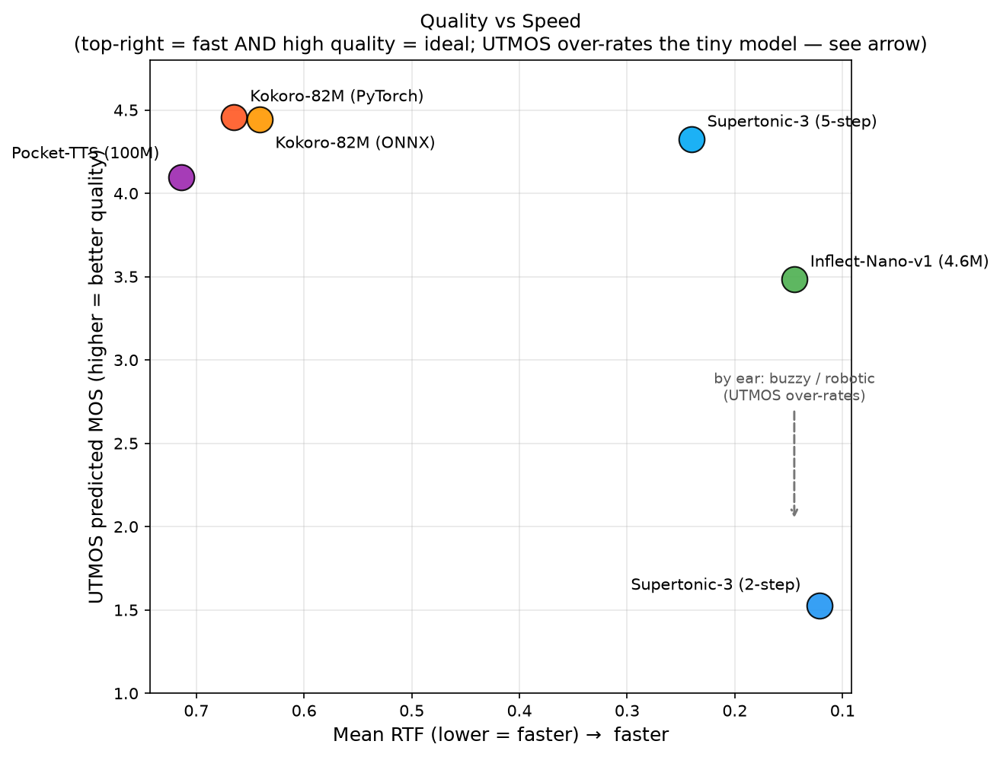
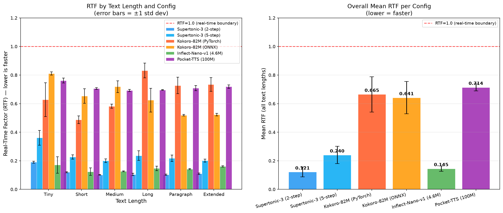
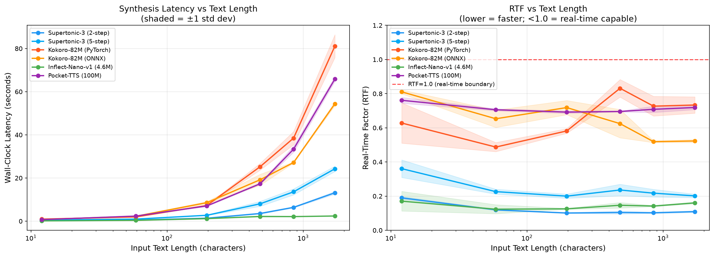

# Kokoro 82M vs Supertonic 3 vs Inflect-Nano-v1 vs Pocket TTS: A Real CPU TTS Benchmark

*A complete evaluation of open-weight TTS models across speed, latency, throughput, and audio quality — run entirely on CPU, no GPU involved, with an objective MOS score for every sample. Now with Kyutai's brand-new Pocket TTS added to the field.*

---

There are a lot of TTS benchmarks floating around that test on high-end hardware, cherry-pick favorable configurations, or only report one metric. This one tries to be more honest. We ran Kokoro 82M, Supertonic 3, Inflect-Nano-v1, and — new this round — **Pocket TTS** head-to-head on a CPU, measured everything that actually matters for a production decision, scored the audio quality with an objective neural MOS model, and listened to the outputs.

**What changed:** Kyutai released Pocket TTS in early 2026 — a ~100M-parameter model built to run in real time on a plain CPU, with zero-shot voice cloning from about five seconds of reference audio. That is exactly the "runs on your laptop, no GPU" bracket this benchmark lives in, so we added it as a sixth configuration and re-ran the entire suite from scratch on the same machine.

The short version: the fastest configuration is still not the one you should ship — and the newest model, Pocket TTS, is the *slowest* in the field yet the most interesting, because it does something none of the others can: clone a voice from about five seconds of audio, on a CPU.

---

## The Models

**Kokoro 82M** is a StyleTTS2-inspired model with 82 million parameters. It was released under Apache 2.0 (weights included), which is rare for a model of this quality. It outputs 24kHz audio and has two deployment paths: a native PyTorch pipeline via the `hexgrad/Kokoro-82M` HuggingFace repo, and an ONNX version from `onnx-community/Kokoro-82M-v1.0-ONNX`. At the time of its release it ranked first on the HuggingFace TTS Arena leaderboard.

**Supertonic 3** is a newer model from Supertone with roughly 99 million parameters. Its architecture uses a Vector Estimator flow-matching backbone, which means the number of inference steps is a tunable parameter at runtime via `total_steps`. Lower steps = faster but lower quality. It supports 31 languages and outputs 44.1kHz audio. The license is OpenRAIL-M, which has some commercial use restrictions.

**Inflect-Nano-v1** (`owensong/Inflect-Nano-v1`) is the outlier: a *tiny* **4.63M-parameter** model — about 18× smaller than Kokoro and 21× smaller than Supertonic. It pairs a compact FastSpeech-style acoustic model (3.47M params) with a Snake-activation HiFi-GAN vocoder (1.17M params), outputs 24kHz audio, and is Apache-2.0. It ships only as a HuggingFace git repo (no pip package) and exposes a single English **male** voice. It uses a `g2p_en` grapheme-to-phoneme frontend rather than espeak.

**Pocket TTS** (`kyutai/pocket-tts`) is the newest entrant and a genuinely different design. Instead of a one-shot acoustic model plus a vocoder, it is a **streaming language model over a neural audio codec** (Kyutai's Mimi) — it generates audio token-by-token the way an LLM generates text, then decodes those tokens to a 24kHz waveform. It is about **100M parameters**, ships as a plain `pip install pocket-tts` package, runs on CPU with no GPU build of PyTorch required, and is **MIT-licensed** (the most permissive license in this field). Its headline feature is **zero-shot voice cloning**: give it roughly five seconds of any voice and it will speak in that voice, capturing accent, tone, and even microphone character. For a fair, single-voice comparison we ran it on one fixed preset voice (`alba`).

---

## What We Measured

The benchmark ran 6 configurations:

- Supertonic-3 at `total_steps=2` (speed mode)
- Supertonic-3 at `total_steps=5` (default quality)
- Kokoro-82M via PyTorch CPU
- Kokoro-82M via ONNX Runtime CPU
- Inflect-Nano-v1 via PyTorch CPU
- Pocket TTS via PyTorch CPU (preset voice `alba`)

Each configuration was tested across 6 text lengths: tiny (12 chars), short (59), medium (196), long (483), paragraph (851), and extended (1712 characters). Every cell got 5 timed repetitions after one discarded warmup run. That is **180 total timed runs**.

The primary metric is **RTF (Real-Time Factor)**: wall-clock synthesis time divided by the duration of the audio produced. RTF below 1.0 means the model synthesizes faster than real-time. Lower is faster.

We also recorded wall-clock latency in seconds, throughput in characters per second, and an **objective MOS** for every sample using **UTMOS** (`utmos22_strong`), a neural mean-opinion-score predictor. We saved one audio sample per configuration per text length (36 WAV files total) for both the MOS scoring and human listening.

Hardware: Intel Xeon Platinum 8272CL, 4 cores available, 15.6GB RAM, no GPU. `CUDA_VISIBLE_DEVICES` was set to empty for all runs. ONNX sessions were forced to `CPUExecutionProvider`.

---

## The Headline

| Config | Mean RTF | vs Real-Time | Mean MOS (UTMOS) | Params | License |
|--------|----------|--------------|------------------|--------|---------|
| Supertonic-3 (2-step) | **0.121** | 8.3× | 1.53 | ~99M | OpenRAIL-M |
| Inflect-Nano-v1 | **0.145** | 6.9× | 3.48† | **4.6M** | Apache-2.0 |
| Supertonic-3 (5-step) | **0.240** | 4.2× | 4.32 | ~99M | OpenRAIL-M |
| Kokoro-82M (ONNX) | **0.641** | 1.6× | 4.44 | 82M | Apache-2.0 |
| Kokoro-82M (PyTorch) | **0.665** | 1.5× | 4.46 | 82M | Apache-2.0 |
| Pocket-TTS | **0.714** | 1.4× | 4.10 | ~100M | **MIT** |

*Quality (UTMOS MOS) against speed (mean RTF). Faster is to the right; higher is better. The ideal corner is top-right. Supertonic-2step is fastest but bottom-of-the-barrel on quality; Kokoro sits top-left (best quality, slowest); Supertonic-5step and Pocket TTS land in usable, high-quality territory. Inflect-Nano's 3.48 is plotted as-measured, but UTMOS over-rates it — by ear it is robotic, so its real-quality position is lower than the dot suggests.*

The chart makes the core point again: speed and quality are different axes, and the fastest config (Supertonic 2-step) is the worst-sounding by a wide margin. But adding Pocket TTS surfaces a second point the chart *can't* show. Four of the six configs — both Kokoros, Supertonic-5step, and Pocket TTS — cluster in the same high-quality band (MOS ~4.1–4.5). Among those, what separates them is no longer naturalness; it's speed, license, and features. Pocket TTS is the slowest of the six, but it is the only one that can speak in a voice you give it — and there is no axis on a speed-vs-quality plot for that.

---

## The Numbers

### RTF by Configuration and Text Length

*Mean RTF per configuration across all text lengths. Lower is faster.*

| Config | Tiny | Short | Medium | Long | Paragraph | Extended | Mean |
|--------|------|-------|--------|------|-----------|----------|------|
| Supertonic-3 (2-step) | 0.190 | 0.120 | 0.101 | 0.104 | 0.102 | 0.109 | **0.121** |
| Supertonic-3 (5-step) | 0.361 | 0.226 | 0.200 | 0.236 | 0.217 | 0.202 | **0.240** |
| Kokoro-82M (PyTorch) | 0.628 | 0.487 | 0.582 | 0.832 | 0.727 | 0.734 | **0.665** |
| Kokoro-82M (ONNX) | 0.811 | 0.653 | 0.719 | 0.625 | 0.519 | 0.523 | **0.641** |
| Inflect-Nano-v1 | 0.171 | 0.123 | 0.126 | 0.147* | 0.142* | 0.161* | **0.145** |
| Pocket-TTS | 0.761 | 0.706 | 0.692 | 0.696 | 0.708 | 0.719 | **0.714** |

Pocket TTS is the slowest configuration here, but look at how *flat* its RTF row is: 0.69–0.76 at every length, from a 12-character greeting to a 1700-character essay. That stability is a direct property of its streaming design — it emits audio tokens at a steady rate, so cost scales linearly with output and there is no fixed overhead that a short prompt has to amortize. It never crosses RTF 1.0, staying about 1.4× faster than real-time throughout. The two Supertonic configs and Inflect-Nano all stay under RTF 0.25 (Supertonic-2step and Inflect-Nano well under, at ~0.12–0.15). Kokoro is the other slow family, and unlike Pocket TTS its RTF actually *rises* on the longest inputs (PyTorch climbs to 0.83 on `long`) rather than holding steady.

*\* Inflect-Nano truncates inputs longer than ~15s of audio — see the caveat below. Its long/paragraph/extended numbers reflect partial synthesis.*

### Wall-Clock Latency (seconds)

| Config | Tiny | Short | Medium | Long | Paragraph | Extended |
|--------|------|-------|--------|------|-----------|----------|
| Supertonic-3 (2-step) | 0.26s | 0.51s | 1.38s | 3.55s | 6.41s | 13.16s |
| Supertonic-3 (5-step) | 0.50s | 0.96s | 2.73s | 8.04s | 13.60s | 24.27s |
| Kokoro-82M (PyTorch) | 0.96s | 1.97s | 7.29s | 25.24s | 38.49s | 81.12s |
| Kokoro-82M (ONNX) | 0.76s | 2.29s | 8.58s | 19.19s | 27.18s | 54.39s |
| Inflect-Nano-v1 | 0.14s | 0.38s | 1.18s | 2.19s* | 2.12s* | 2.40s* |
| Pocket-TTS | 0.73s | 2.36s | 7.07s | 17.36s | 33.39s | 65.85s |

### Throughput (chars/sec)

| Config | Tiny | Short | Medium | Long | Paragraph | Extended |
|--------|------|-------|--------|------|-----------|----------|
| Supertonic-3 (2-step) | 45.4 | 116.1 | 141.9 | 136.6 | 132.9 | 130.4 |
| Supertonic-3 (5-step) | 24.2 | 61.5 | 72.0 | 61.1 | 63.1 | 70.7 |
| Kokoro-82M (PyTorch) | 12.8 | 30.0 | 26.9 | 19.2 | 22.2 | 21.2 |
| Kokoro-82M (ONNX) | 15.8 | 25.9 | 22.9 | 25.5 | 31.3 | 31.5 |
| Inflect-Nano-v1 | 92.6 | 158.5 | 166.2 | 222.5* | 401.6* | 714.6* |
| Pocket-TTS | 16.5 | 25.1 | 27.7 | 27.8 | 25.5 | 26.0 |

*\* Inflect-Nano's throughput at length looks enormous because it stops generating after ~15s of audio regardless of how much text you give it. Those chars/sec are not real synthesis rates.*

### Audio Quality — UTMOS Predicted MOS (higher = more natural)

**What is MOS?** MOS stands for **Mean Opinion Score** — the standard way speech quality is rated. Traditionally, a panel of human listeners hears each audio clip and rates it on a 1-to-5 scale (1 = bad/robotic, 5 = excellent/natural), and the scores are averaged. Collecting human ratings is slow and expensive, so here we use **UTMOS**, a neural network trained to *predict* that human MOS score automatically from the audio. It gives us a 1–5 number for every sample without a listening panel — fast and repeatable, but, as we'll see, not perfect.

| Config | Tiny | Short | Medium | Long | Paragraph | Extended | Mean |
|--------|------|-------|--------|------|-----------|----------|------|
| Supertonic-3 (2-step) | 1.87 | 1.57 | 1.58 | 1.43 | 1.36 | 1.34 | **1.53** |
| Supertonic-3 (5-step) | 4.25 | 4.43 | 4.37 | 4.52 | 4.30 | 4.09 | **4.32** |
| Kokoro-82M (PyTorch) | 4.08 | 4.51 | 4.55 | 4.54 | 4.53 | 4.53 | **4.46** |
| Kokoro-82M (ONNX) | 4.04 | 4.51 | 4.54 | 4.55 | 4.52 | 4.49 | **4.44** |
| Inflect-Nano-v1 | 3.02 | 4.15 | 3.90 | 3.45 | 3.01 | 3.37 | **3.48** |
| Pocket-TTS | 3.76 | 4.44 | 4.12 | 4.14 | 4.07 | 4.05 | **4.10** |

UTMOS tracks the listening test well at the extremes — Supertonic-2step's robotic output scores 1.53, while both Kokoros and Supertonic-5step cluster around 4.3–4.5. Pocket TTS lands at **4.10**: a notch below Kokoro, but clearly in the natural-sounding tier, and here the metric and the audio agree — the samples are clean and well-modulated, with none of the vocoder buzz that gives away a small model. The one score to distrust is **Inflect-Nano's 3.48**. It reads mid-pack, but to the ear the model is buzzy and robotic. That is a known UTMOS failure mode: it rewards small HiFi-GAN vocoders for being *clean* even when they are not *natural*. Read Inflect-Nano's 3.48 as an optimistic upper bound, not a usability verdict — and note how differently it and Pocket TTS earn similar-looking metric scores.

---

## The Newcomer: Pocket TTS

Pocket TTS is the most interesting addition to this benchmark, and not because it wins a speed race — it doesn't. At mean RTF **0.714** it is the *slowest* of the six configurations, though still comfortably faster than real-time (~1.4×). Everything else about it is what stands out.

**Quality.** Its UTMOS is 4.10 — below the two Kokoro variants (~4.45) and Supertonic-5step (4.32), but solidly in the natural-sounding band. Crucially, and unlike Inflect-Nano, its metric score and its actual sound agree: the audio is clean and well-modulated, with none of the metallic buzz that betrays a small vocoder. On quality it behaves like Kokoro and Supertonic-5step, not like the tiny model that scores near it on paper.

**Predictable latency.** Look again at its RTF row: 0.76, 0.71, 0.69, 0.70, 0.71, 0.72 — essentially flat from a one-word greeting to a 1700-character essay. Because it streams audio tokens one at a time, its cost scales linearly and predictably with output length. Kokoro, by contrast, gets *slower* per second of audio on long inputs. If you are budgeting for worst-case latency in an interactive system, a flat RTF curve is worth a lot.

**Deployment.** `pip install pocket-tts` and it runs on CPU with a stock PyTorch — no CUDA build, no ONNX export, no HuggingFace-repo-and-`sys.path` wiring. Of the six configs, it was the least fussy to integrate, and it downloads its own weights on first load.

And then there is the thing it does that no other model here can.

### What the numbers can't show: voice cloning

Every other model in this benchmark ships a fixed set of voices. You pick one and that is what you get. Pocket TTS is different: hand it roughly **five seconds of any voice** and it will speak your text in that voice — accent, timbre, pacing, even the room and microphone character of the reference clip. This is zero-shot; there is no fine-tuning step.

That capability does not show up anywhere in an RTF or MOS table, because we deliberately pinned Pocket TTS to a single preset voice (`alba`) to keep the speed and quality comparison fair against the fixed-voice models. So read the numbers above as the *floor* of what Pocket TTS offers — the thing it is actually built for is the one column a benchmark table doesn't have. If your product needs custom or user-supplied voices on a CPU, none of the other four models here can do it at all, and Pocket TTS does it out of the box under an MIT license.

---

## The Tiny-Model Story: Inflect-Nano-v1

The most surprising *speed* result in the benchmark is what a 4.6M-parameter model can do. Inflect-Nano-v1 is the **second-fastest configuration overall** (mean RTF 0.145, 6.9× real-time), behind only Supertonic's quality-destroying 2-step mode — and it does this with under 5% of Kokoro's parameter count.

But it is not high-fidelity. On its UTMOS score (3.48) it looks mid-pack, and it is genuinely more intelligible than Supertonic-2step — but a careful listen tells a blunter story: the voice is **buzzy and robotic**, with a metallic vocoder texture and flat, monotone prosody. It is clearly synthetic in a way Kokoro, Supertonic-5step, and Pocket TTS are not. The honest framing is narrow: on a maximum-speed budget, Inflect-Nano is a more *intelligible* option than Supertonic-2step at the same latency — not a natural-sounding one. Don't let its 3.48 UTMOS, which over-rates small vocoders, read as "good."

### The catch: a hard ~15-second output cap

There is one critical limitation you must know about. Inflect-Nano-v1's acoustic model is configured with `max_frames = 1400`, which caps synthesis at **~14.93 seconds of audio no matter how long the input text is**. Feed it a 1700-character essay and it renders the first ~15 seconds and silently drops the rest.

You can see this directly in the audio durations: for the `long`, `paragraph`, and `extended` inputs, Inflect-Nano produces an identical **14.93s** of audio, while every other model scales to 30–120s. That means its RTF and throughput on those three rows are *inflated* — it is doing far less work than the models it is being compared against. The honest comparison for Inflect-Nano is the `tiny`/`short`/`medium` rows, where the full text fits inside the cap.

For long-form synthesis you would need to split text into sub-15-second chunks yourself. For short, interactive utterances — chatbot replies, voice-assistant responses, notifications — the cap rarely bites, and this is exactly where a 4.6M-param model that runs many times faster than real-time is compelling.

---

## Audio Quality: Where the Story Changes

RTF numbers alone would make Supertonic 2-step the obvious choice. But the MOS scores — and our ears — tell a more complicated story.

The text used for the short samples below is the classic pangram: *"The quick brown fox jumps over the lazy dog."*

**Supertonic-3 at 2-step** sounds robotic (MOS 1.53). Words blur together and some are hard to make out. This is not a bug: it is a fundamental property of flow-matching models — fewer denoising steps means less waveform refinement. The RTF of 0.121 is impressive on paper, but the output is not something you would put in front of a user.

🔊 [Listen — Supertonic-3 (2-step), short](https://github.com/gauravvij/kokoro-tts-vs-supertonic-3-tts/raw/main/results/audio_samples/Supertonic_2step_short.wav)

**Supertonic-3 at 5-step** (MOS 4.32) is a different story — clearly intelligible, fully audible, and usable. It lacks some of the warmth and natural prosody of Kokoro, but it is not robotic. If latency is your primary constraint and you can accept slightly flat delivery, this is a reasonable choice.

🔊 [Listen — Supertonic-3 (5-step), short](https://github.com/gauravvij/kokoro-tts-vs-supertonic-3-tts/raw/main/results/audio_samples/Supertonic_5step_short.wav)

**Kokoro 82M** (both PyTorch and ONNX, MOS ~4.45) produces human-like speech. The prosody is natural, the pacing feels right, and it does not sound like a TTS system in the way older models do. The PyTorch and ONNX variants are perceptually indistinguishable — their MOS scores match to two decimals.

🔊 [Listen — Kokoro-82M (PyTorch), short](https://github.com/gauravvij/kokoro-tts-vs-supertonic-3-tts/raw/main/results/audio_samples/Kokoro_PyTorch_short.wav)

**Pocket TTS** (MOS 4.10) sits just below Kokoro and is clearly in the natural-sounding tier: the delivery is smooth and clean, the level is healthy, and there is no vocoder buzz. On the short pangram it scores 4.44 — matching Kokoro's overall average — and settles to ~4.1 on longer text. It is the only sample here spoken by a preset voice you could have swapped for your own with five seconds of audio.

🔊 [Listen — Pocket-TTS, short](https://github.com/gauravvij/kokoro-tts-vs-supertonic-3-tts/raw/main/results/audio_samples/Pocket_TTS_short.wav)

**Inflect-Nano-v1** (UTMOS 3.48 overall) is a single male voice that is **buzzy and robotic** to the ear — a metallic vocoder texture and flat prosody — despite the mid-range metric score. It is more intelligible than Supertonic-2step, but it does not approach Kokoro, Supertonic-5step, or Pocket TTS. Impressive that a sub-5-megabyte model is intelligible at all; just don't expect natural.

🔊 [Listen — Inflect-Nano-v1, short](https://github.com/gauravvij/kokoro-tts-vs-supertonic-3-tts/raw/main/results/audio_samples/Inflect_Nano_short.wav)

> *Note: the quality prose above is anchored to the objective UTMOS scores and an inspection of the short/medium samples. All 36 WAV files are in the repo — give them a listen and adjust the wording to your own ears.*

---

## The Combined Picture

| Config | Mean RTF | MOS | Params | License | Practical Verdict |
|--------|----------|-----|--------|---------|-------------------|
| Supertonic-3 (2-step) | 0.121 | 1.53 | ~99M | OpenRAIL-M | Prototyping only (robotic) |
| Inflect-Nano-v1 | 0.145 | 3.48† | 4.6M | Apache-2.0 | Tiny + fast, but buzzy/robotic; short utterances only; ~15s cap |
| Supertonic-3 (5-step) | 0.240 | 4.32 | ~99M | OpenRAIL-M | Latency-critical, quality-acceptable |
| Kokoro-82M (ONNX) | 0.641 | 4.44 | 82M | Apache-2.0 | Quality-first, lightweight deploy |
| Kokoro-82M (PyTorch) | 0.665 | 4.46 | 82M | Apache-2.0 | Quality-first, PyTorch stack |
| Pocket-TTS | 0.714 | 4.10 | ~100M | MIT | Voice cloning on CPU; natural quality; most permissive license |

A few takeaways:

- **If audio quality matters, Kokoro 82M wins** (MOS ~4.45). It is the slowest of the older three families on this CPU, but the output is human-like, and it is Apache 2.0 — which matters for commercial use.
- **For the best speed/quality balance, Supertonic-3 at 5-step** (MOS 4.32 at 4.2× real-time) is hard to beat — usable quality at a fraction of Kokoro's latency.
- **If you need custom or user-supplied voices, Pocket TTS is the only option here.** It is the slowest config (1.4× real-time) and a notch below Kokoro on UTMOS (4.10), but it clones a voice from ~5 seconds of audio, sounds genuinely natural, has the flattest latency curve of any model in the test, ships as a one-line `pip install`, and is MIT-licensed. For anything voice-personalized on a CPU, it is in a category of one.
- **Inflect-Nano-v1 is an impressive engineering demo more than a production voice**: 4.6M params at 6.9× real-time is remarkable, and it is more intelligible than Supertonic-2step — but it is buzzy and robotic by ear, and it caps output at ~15 seconds. Reach for it only when footprint and speed dominate and voice quality is genuinely secondary.
- **Supertonic-3 at 2-step is a prototyping tool, not a production config.** Its MOS of 1.53 is the objective version of "it sounds robotic."
- **UTMOS over-rated the tiny model.** Its 3.48 for Inflect-Nano disagreed with every human listen (buzzy/robotic), while Pocket TTS's similar-tier scores match how it actually sounds. Objective MOS is a useful signal at the extremes, but on small HiFi-GAN vocoders it can flatter clean-but-mechanical output — worth remembering before trusting a single quality number.

†*Inflect-Nano's 3.48 UTMOS over-rates its perceived quality; by ear it is buzzy/robotic.*

---

## How This Benchmark Was Run

This evaluation was produced by **Neo**, an autonomous AI engineering agent. The original three-model benchmark was extended in a single pass: add Kyutai's newly released Pocket TTS as a sixth configuration and re-run the whole suite so every number is directly comparable.

From that prompt, Neo:

1. Researched Pocket TTS's architecture and API — confirming from the installed package (not documentation) that `generate_audio()` chunks text internally and returns the full waveform, so unlike Inflect-Nano it has no silent length cap
2. Wrote a `PocketTTSRunner` for the existing harness, loading the model once and reusing a fixed preset voice across all runs so timing measures synthesis only
3. Re-ran all **6 configurations × 6 text lengths × 5 repetitions = 180 timed runs** on a single machine for an apples-to-apples comparison
4. Re-scored every sample with UTMOS (`utmos22_strong`) loaded from torch.hub, including the new Pocket TTS samples
5. Regenerated the report, charts, and this writeup — all numbers below come from this fresh run on the same Xeon 8272CL as the original benchmark

---

## Replicate or Extend This Benchmark

The full benchmark code, raw results, charts, and audio samples are in this repo.

The key files:

- `benchmark.py` — the full harness, runs all 180 timed experiments (6 configs)
- `mos_eval.py` — scores every saved WAV with UTMOS, writes `results/mos_results.csv`
- `report.py` — reads the CSVs, generates the markdown report and charts
- `results/raw_results.csv` — raw timing data, 180 rows
- `results/mos_results.csv` — per-sample MOS scores
- `results/benchmark_report.md` — the full report
- `results/charts/` — RTF comparison, latency vs length, and quality-vs-speed charts
- `results/audio_samples/` — 36 WAV files for quality listening

To re-run from scratch you need Python 3.10+, espeak-ng installed system-wide, and the Python packages: `supertonic`, `kokoro`, `kokoro-onnx`, `pocket-tts`, `onnxruntime`, `soundfile`, `matplotlib`, `pandas`, `numpy`, `torch`, `torchaudio`, `numba`, plus `g2p_en`/`transformers` and the Inflect-Nano repo (`git clone https://huggingface.co/owensong/Inflect-Nano-v1 models/Inflect-Nano-v1`). Pocket TTS downloads its own weights on first load. The Kokoro ONNX model files and voices binary go in `models/` (see the download commands in the README).

---

*Hardware: Intel Xeon Platinum 8272CL, 4 cores, 15.6GB RAM, no GPU. Python 3.12.3. supertonic 1.3.1, kokoro 0.9.4, kokoro-onnx 0.5.0, pocket-tts 2.1.0, onnxruntime 1.27.0, torch 2.12.1, UTMOS utmos22_strong.*
